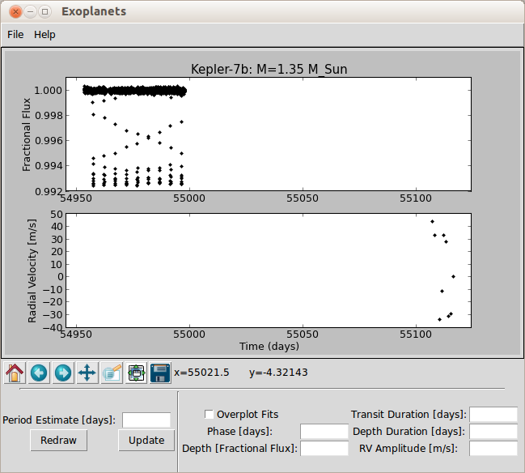
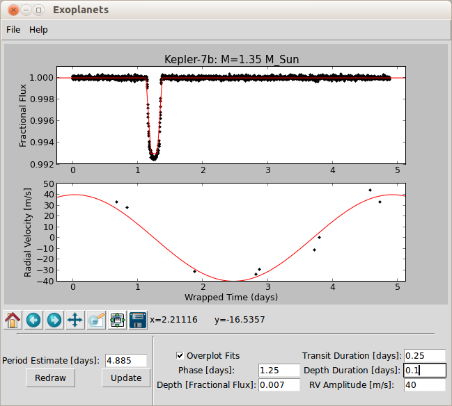

# Exoplanets Laboratory

Cornell astronomy lab on exoplanet detection and properties. Using lightcurve and radial velocity data from the initial Kepler hot Jupiter sources, students fit the data using an interactive graphics user interface:

The laboratory worksheet for the Spring 2014 teaching of Astro 1104 (Our Solar System) is available [here](2_Exoplanets.pdf) along with the LaTeX source code so that you can modify at will. 
